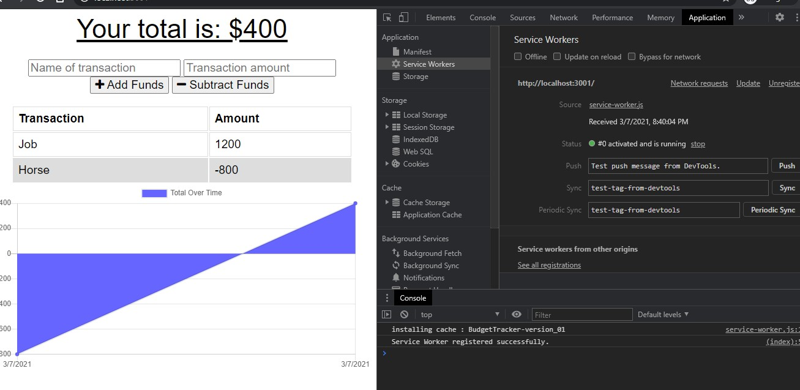

## BudgetTracker
A simple PWA Budget Tracker app!

## User Story 
```
AS AN avid traveler
I WANT to be able to track my withdrawals and deposits with or without a data/internet connection
SO THAT my account balance is accurate when I am traveling 
```
## Acceptance Criteria
```
GIVEN a budget tracker without an internet connection
WHEN the user inputs an expense or deposit
THEN they will receive a notification that they have added an expense or deposit
WHEN the user reestablishes an internet connection
THEN the deposits or expenses added while they were offline are added to their transaction history and their totals are updated
```

  ## 💽 Installation
   This app is deployed and ready for use on Heroku! You can also install this as a PWA on your phone or desktop computer. 

  ## ➕ Features
   node.JS Mongoose MongoDB Express.js CSS Javascript HTML  

  ## 💾 Screenshots
  
  
 
 ## 🖥️ Links 
GitHub: https://github.com/clhurlbut/budget-tracker <br>
Deployed Heroku App: https://secure-eyrie-31260.herokuapp.com/

  ## 🧑‍🤝‍🧑 Contributing
   [Contributor Covenant](https://www.contributor-covenant.org/)

  ## 💖 Credits
   Thank you to UCLA / Trilogy Bootcamp!

  ## 📒 License 
   This project is using the MIT License. 

  ## 🙋 Questions 
   Please feel free to contact the developer with any questions/comments/concerns. 
   
   📧 **Email**
   <clhurlbut@gmail.com>
   
   🔗 **GitHub** 
   [clhurlbut](https://github.com/clhurlbut)


